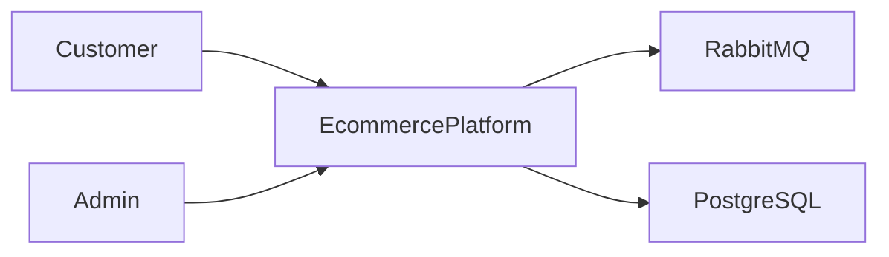
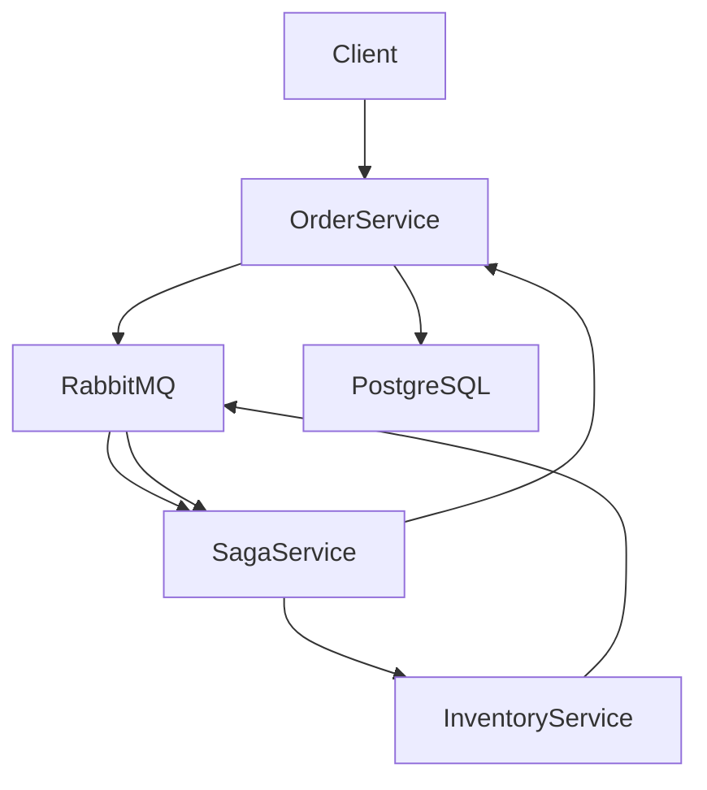
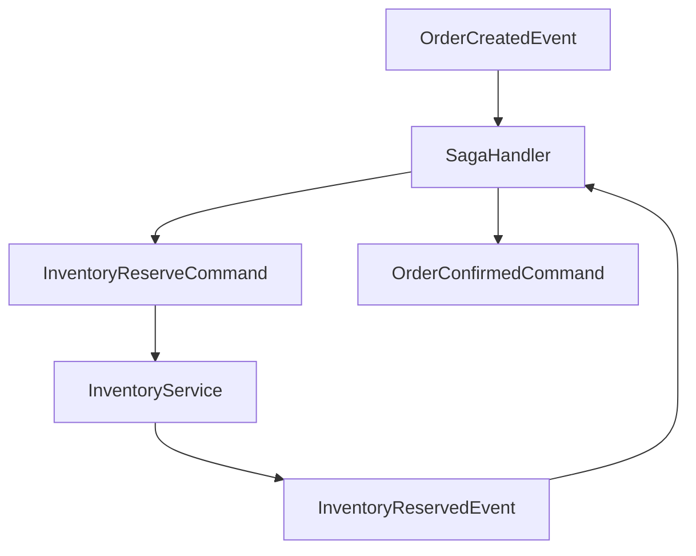
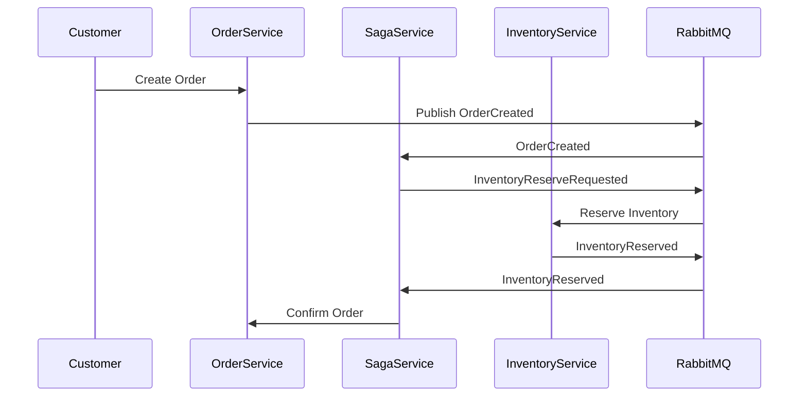
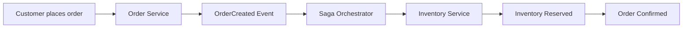

# E-commerce Microservices Architecture Lab

⚠️ This repository is an architecture lab created to explore
event-driven microservices patterns and saga orchestration.

It is not intended to be a production-ready e-commerce system.

Architecture lab exploring **event-driven microservices architecture** for an e-commerce platform using **Symfony Messenger, RabbitMQ, Docker, and PostgreSQL**.

The goal of this project is to experiment with **distributed systems patterns**, especially **Saga orchestration**, for coordinating multiple services in a microservices-based e-commerce system.

---

# Project Goals

- Understand **event-driven architecture**
- Implement **Saga orchestration pattern**
- Explore **asynchronous messaging with RabbitMQ**
- Learn **microservices communication using Symfony Messenger**
- Build a realistic **e-commerce order workflow across services**

---

# Technologies

- PHP 8
- Symfony 7
- Symfony Messenger
- RabbitMQ
- Docker
- PostgreSQL

---

# C4 Architecture Overview

The C4 model describes software architecture at multiple levels.

Levels included here:

1. **System Context**
2. **Container Diagram**
3. **Component Diagram**

---

# 1. System Context Diagram

Shows how the platform interacts with external actors and systems.



---

# 2. Container Diagram

Shows major containers/services within the platform.



---

# 3. Component Diagram

Breakdown of components inside the Saga service.



---

# Requirement Gathering

The system models a simplified e-commerce platform capable of:

- Creating orders
- Reserving inventory
- Processing distributed workflows across services
- Coordinating services through messaging

Key requirement:

Distributed services must complete workflows **without distributed database transactions**, using **Saga orchestration**.

---

# Feature Requirements

## Functional Requirements

1. Create Order
2. Trigger OrderCreated event
3. Reserve inventory
4. Confirm order
5. Handle failures using Saga compensation

## Non-Functional Requirements

- Asynchronous messaging
- Service decoupling
- Fault tolerance
- Event-driven architecture
- Horizontal scalability

---

# Quality Attributes

### Scalability
Services communicate via messaging allowing independent scaling.

### Fault Tolerance
Failures are isolated and handled through Saga compensation.

### Loose Coupling
Services communicate only through events.

### Maintainability
Each service has a clear responsibility.

---

# Actors / Users

| Actor | Description |
|------|-------------|
| Customer | Places orders |
| Admin | Manages system |
| Order Service | Creates orders |
| Inventory Service | Manages stock |
| Saga Orchestrator | Coordinates workflow |
| RabbitMQ | Messaging infrastructure |

---

# System Constraints

- Communication via messaging only
- RabbitMQ used as event transport
- Distributed transactions handled via Saga pattern
- Services must remain loosely coupled
- Development environment runs with Docker

---

# Saga Sequence Diagram



---

# User Flow Diagram



---

# Event Flow

OrderCreated  
↓  
InventoryReserveRequested  
↓  
InventoryReserved  
↓  
OrderConfirmed  

Failure path:

OrderCreated  
↓  
InventoryReserveRequested  
↓  
InventoryFailed  
↓  
Saga Compensation  

---

# Current Implementation Status

✔ Docker environment  
✔ Symfony services setup  
✔ RabbitMQ messaging  
✔ Messenger transports  
✔ Saga orchestration basic flow  

---

# Roadmap

## Phase 1 – Foundation
- Setup Docker
- Configure Messenger
- Integrate RabbitMQ

## Phase 2 – Services
- Implement Order Service
- Implement Inventory Service

## Phase 3 – Saga
- Saga orchestrator
- Compensation logic

## Phase 4 – Observability
- Logging
- Queue monitoring

## Phase 5 – Advanced
- Payment service
- Retry policies
- Dead-letter queues
- Idempotency

---

# Running the Project

Start containers:

```bash
docker compose up --build
```

Run messenger worker:

```bash
php bin/console messenger:consume async
```

---

# Learning Objectives

This repository demonstrates:

- Event-driven microservices
- Saga orchestration
- Messaging-based system integration
- Distributed workflow coordination

---

# Author

**Aniruddha Deshpande**  
Technical Architect | API Platforms | Marketplace Integrations | Symfony / PHP
